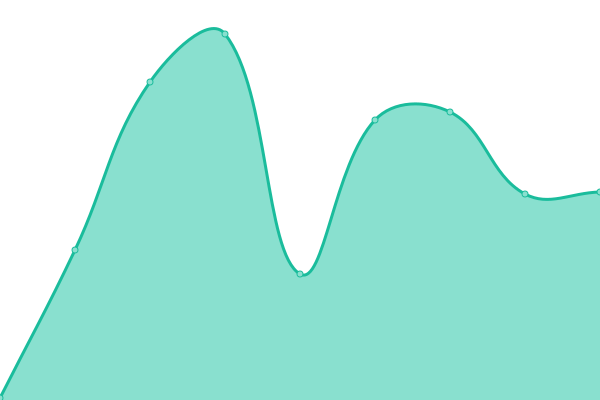
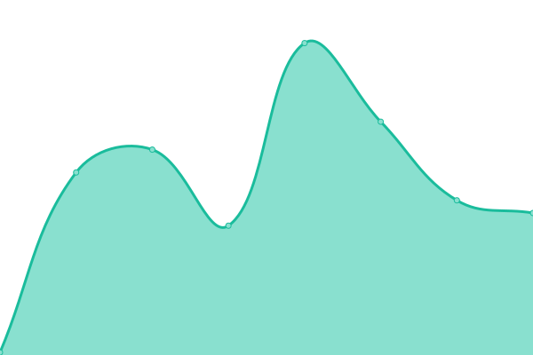

# [📈 Live Status](https://status.getreica.com): <!--live status--> **🟩 All systems operational**

This repository contains the open-source uptime monitor and status page for [Reica](https://getreica.com), powered by [Upptime](https://github.com/upptime/upptime).

With [Upptime](https://upptime.js.org), you can get your own unlimited and free uptime monitor and status page, powered entirely by a GitHub repository. We use [Issues](https://github.com/getreica/status-page/issues) as incident reports, [Actions](https://github.com/getreica/status-page/actions) as uptime monitors, and [Pages](https://status.getreica.com) for the status page.

<!--start: status pages-->
<!-- This summary is generated by Upptime (https://github.com/upptime/upptime) -->
<!-- Do not edit this manually, your changes will be overwritten -->
<!-- prettier-ignore -->
| URL | Status | History | Response Time | Uptime |
| --- | ------ | ------- | ------------- | ------ |
|  Reica Website | 🟩 Up | [reica-website.yml](https://github.com/getreica/status-page/commits/HEAD/history/reica-website.yml) | 

 583ms
     
 | 

<a href="https://status.getreica.com/history/reica-website">100.00%</a>
    

|  Product Service | 🟩 Up | [product-service.yml](https://github.com/getreica/status-page/commits/HEAD/history/product-service.yml) | 

 451ms
     
 | 

<a href="https://status.getreica.com/history/product-service">100.00%</a>
    

|  API Service | 🟩 Up | [api-service.yml](https://github.com/getreica/status-page/commits/HEAD/history/api-service.yml) | 

 1072ms
     
 | 

<a href="https://status.getreica.com/history/api-service">100.00%</a>
    

|  Relevance Score | 🟩 Up | [relevance-score.yml](https://github.com/getreica/status-page/commits/HEAD/history/relevance-score.yml) | 

 132ms
     
 | 

<a href="https://status.getreica.com/history/relevance-score">100.00%</a>
    

|  Database | 🟩 Up | [database.yml](https://github.com/getreica/status-page/commits/HEAD/history/database.yml) | 

 80ms
     
 | 

<a href="https://status.getreica.com/history/database">100.00%</a>
    

<!--end: status pages-->

[**Visit our status website →**](https://status.getreica.com)

## 📄 License

- Powered by: [Upptime](https://github.com/upptime/upptime)
- Code: [MIT](./LICENSE) © [Anand Chowdhary](https://anandchowdhary.com), supported by [Pabio](https://pabio.com)
- Data in the `./history` directory: [Open Database License](https://opendatacommons.org/licenses/odbl/1-0/)
